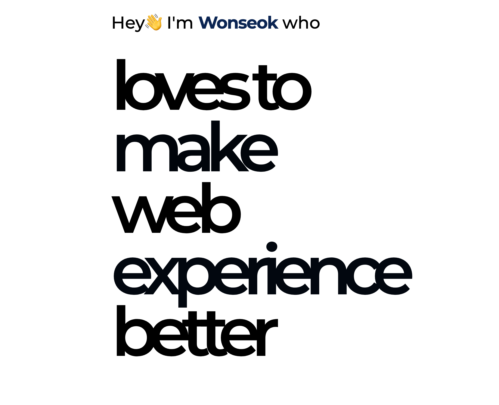
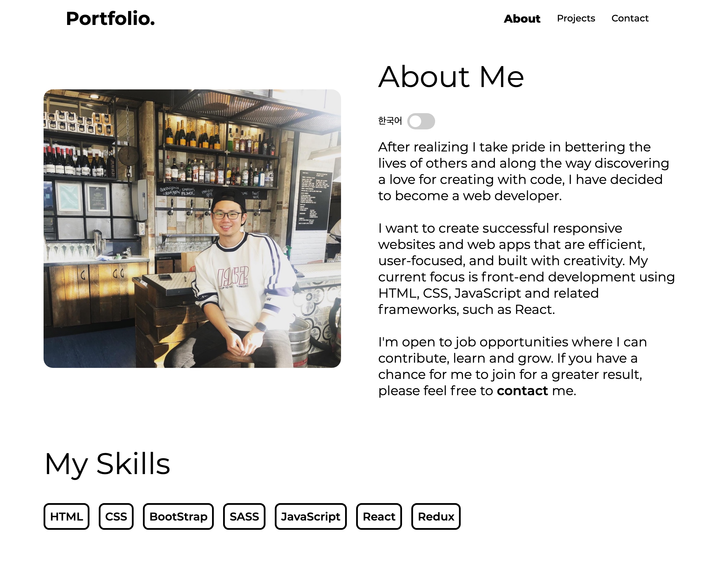
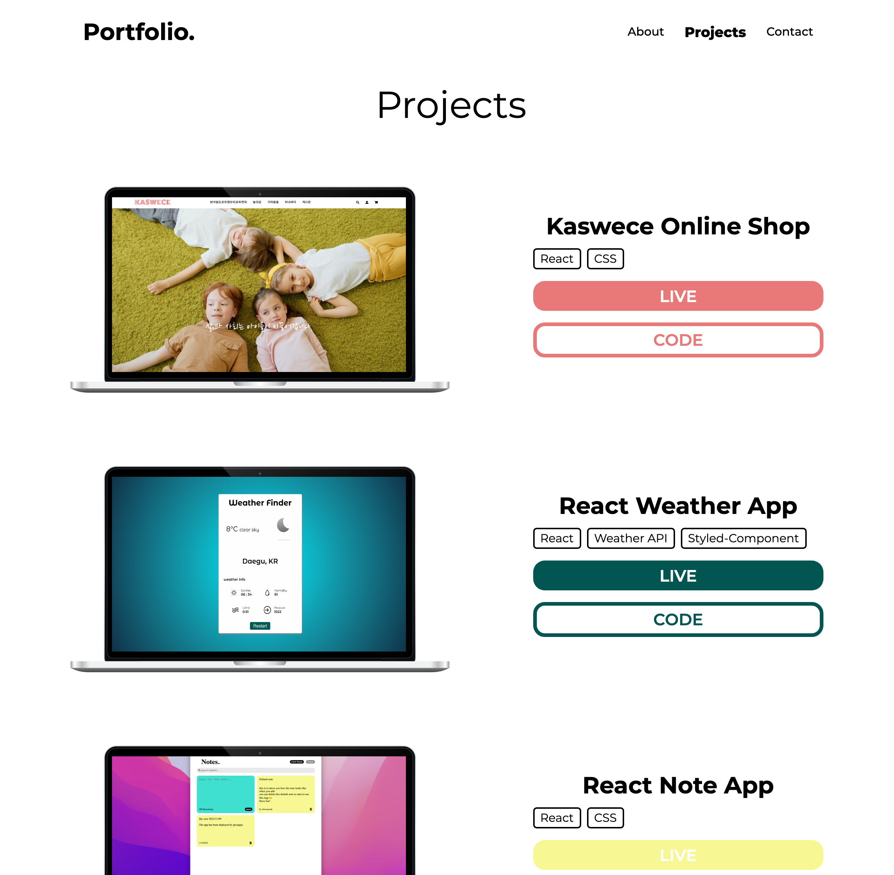
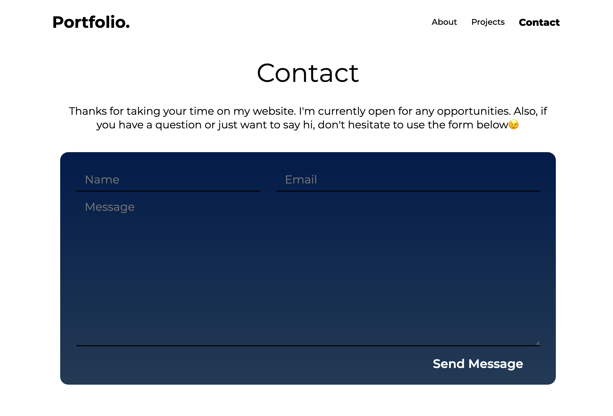

# Portfolio

> This is my portfolio built with React.js

미니멀하면서도 필요한 정보만 깔끔하게 전달하는 포트폴리오 사이트를 구현하고 싶었습니다.  
landing page의 디자인은 최근 EPL에서 사용 중인 [No room for racism](https://www.premierleague.com/NoRoomForRacism)에서 영감을 받았습니다.  
현재 구현된 디자인에서 추가하거나 변경할 아이디어가 있기에 꾸준히 업데이트 할 예정입니다.

---

# Live

[https://chwonseok.github.io/portfolio/](https://chwonseok.github.io/portfolio/)

---

## Skills

HTML, CSS, JavaScript, React

---

## Update History

- 2021.11.12. - Kakao Clone 프로젝트 제거
- 2021.11.10. - Random Number Game 프로젝트 제거
- 2021.11.09. - note app 프로젝트 추가, apple calculator 프로젝트 제거
- 2021.10.17. - 반응형으로 완성 tested with iphone8, iphone12 for small devices
- 2021.10.16. - Kawece 프로젝트 추가
- 2021.10.01. - rough Contact Me 페이지 등록
- 2021.09.27. - pc view 완성

---
